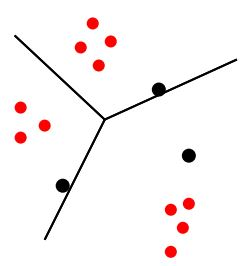

# CUSTOMER SEGMENTATION USING KMEANS CLUSTERING
Clustering is the process of organizing objects into groups whose members are similar in some way. K-means clustering is one of the most popular and simple clustering algorithms. The purpose of K-means is to group observational data points into different subgroups. One of the main applications of K means clustering is customer segmentation with the aim of increasing company revenue.

Let A={ai | i=1,…,f} be attributes of f-dimensional vectors and X={xi | i=1,…,N} be each data
of A. The K-means clustering separates X into k partitions called clusters S={si | i=1,…,k}
where M ∈ X is Mi={mij | j=1,…, n(si)} as members of si, where n(si) is number of members
for si. Each cluster has cluster center of C={ci | i=1,…,k}. K-means clustering algorithm can
be described as follows:

  

1. Initiate its algorithm by generating random starting
points of initial centroids C.
2. Calculate the distance d between X to cluster center
C. Euclidean distance is commonly used to express
the distance.
3. Separate xi for i=1..N into S in which it has minimum
d(xi,C).
4. Determine the new cluster centers ci for i=1..k
5. Go back to step 2 until all centroids are convergent.

##Let's Get Started

Below are the steps to create customer segmentation with k means clustering:
1. Import Library
2. Read dataset (Customer Segmentation)
3. Exploratory Data Analysis (EDA)
4. Preprocessing, for preprocessing encoding is done, namely changing the data from categorical to numerical form so that it can be processed.
5. Forming a cluster model with KMeans
6. Finding the optimum value of k, in order to get good results
7. Clustering uses the optimum value of k
8. Visualization of Customer Segmentation results with KMeans Clustering
